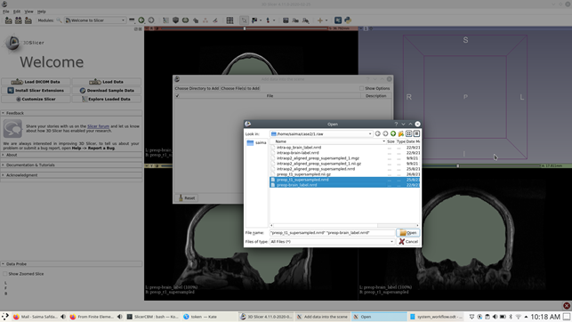
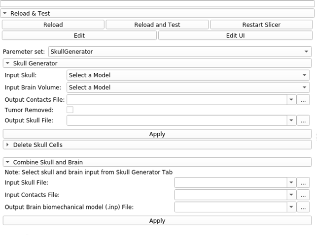
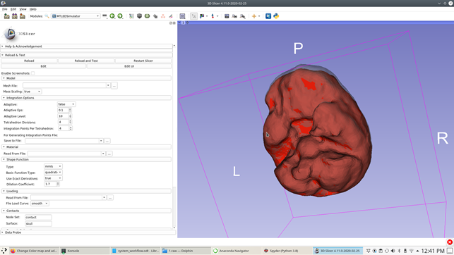
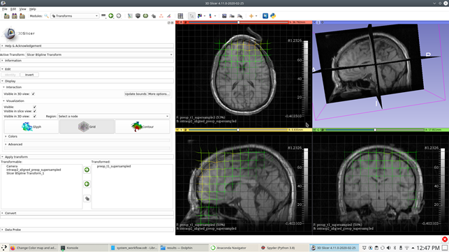

# Patient-specific brain biomechanical model construction

This section illustrates the steps to construct a patient-specific brain
biomechanical model for craniotomy-induced brain shift and electrode
placement-induced brain shift case studies.

## Loading image data

{#fig:load_data
width="\\textwidth"}

1.  Select Slicer4 and then "Load Data" module.

2.  Select "Choose files to Add" to add files from the system. Many of
    the file formats are supported.

3.  Hit open and ok to load them in the Slicer4. The image opens in
    sagittal, axial and coronal view as shown in
    Fig [1.1](#fig:load_data){reference-type="ref"
    reference="fig:load_data"}.

## Rigid registration

In case of craniotomy-induced brain shift and tumour resection-induced
brain shift, we rigidly registered pre-operative MRI to
intra/post-operative MRI. We used the "General Registration" module
within 3D Slicer to do the rigid registration of pre-operative MRI to
intra-operative MRI.

The steps are as follows:

1.  Select the "General Registration (BRAINS)" module.

2.  Select the "Fixed Input Volume" pre-operative MRI.

3.  Select the "Moving Input Volume" intra/post-operative MRI or
    (intra-operative CT).

4.  Select the "Slicer Linear Transform" as we are using the rigid
    registration method with (6 DOF) under section "Registration
    Phases".

5.  Select the "Output Image Volume" as new volume with name of your
    choice. This volume is the intra/post-operative MRI or
    (intra-operative CT) registered to pre-operative MRI volume.

6.  Hit "Apply"

{#fig:rigid width="\\textwidth"}

In case of electrode placement-induced brain shift, we rigidly
registered the pre-operative MRI to intra-operative CT (see
Fig. [1.2](#fig:rigid){reference-type="ref" reference="fig:rigid"}).

## Skull stripping

We performed skull stripping using FreeSurfer the results of the skull
stripped brain mask are loaded in the
Fig. [1.3](#fig:mask){reference-type="ref" reference="fig:mask"}.

{#fig:mask width="\\textwidth"}

## Surface construction using "Model Maker" module of 3D Slicer

{#fig:surface_model width="\\textwidth"}

After getting brain mask using FreeSurfer, create a brain surface model
(see Fig. [1.4](#fig:surface_model){reference-type="ref"
reference="fig:surface_model"}) using the ModelMaker module. The steps
are as follows:

1.  Select the "Model Maker" module from the Modules search window.

2.  Select the "Parameter set" as a new Model Maker.

3.  Select the "Input Volume" as the brain mask volume.

4.  Select the Models as new Models

5.  Select the "Model Name" for the new Model

6.  Check the check box for "Generate All Models"

7.  Select Smooth as 5% or according to how much smoothing of the model
    is required. The more the number the more smoothing. We select it to
    5%.

8.  Select the Laplacian for "Filter Type"

9.  Select Decimate to zero.

10. Uncheck "Split Normals", "Point Normals" and "Pad".

11. Let all the parameters remain the same.

12. Hit "Apply"

13. The results is a Model which is shown in the 3D window of the 3D
    Slicer.

Surface Toolbox (see
Fig. [1.7](#fig:surface_model2){reference-type="ref"
reference="fig:surface_model2"}) can be used to smooth the polygonal
surface of the model if needed.

{#fig:surface_model2
width="\\textwidth"}

## Patient-specific brain model construction

The patient-specific brain model construction begins with a surface
loaded from an external file (see
Fig. [1.6](#fig:2d_model){reference-type="ref"
reference="fig:2d_model"}). The steps are as follows:

1.  Select the "Input File" of the model as .stl file.

2.  Select the "Number of clusters". The more the number of clusters the
    more dense the constructed mesh (see
    Fig. [1.4](#fig:surface_model){reference-type="ref"
    reference="fig:surface_model"} and
    [1.7](#fig:surface_model2){reference-type="ref"
    reference="fig:surface_model2"}).

3.  Hit "Apply".

4.  The result is a redefined unified triangulation of the surface with
    the specified cluster numbers.

{reference-type="ref"
reference="fig:surface_model"}) with 2000
clusters.](./figs/2Dmodel.png){#fig:2d_model width="\\textwidth"}

{#fig:surface_model2
width="\\textwidth"}

{#fig:surface_model3 width="\\textwidth"}

{#fig:3d_model width="\\textwidth"}

To create a volumetric mesh with tetrahedral elements, we use
triangulated surface (see
Fig. [1.8](#fig:surface_model3){reference-type="ref"
reference="fig:surface_model3"}) to create a volumetric tetrahedral mesh
(see Fig. [1.9](#fig:3d_model){reference-type="ref"
reference="fig:3d_model"}). The steps are as follows:

1.  Select the "Patient Surface Mesh Model" as an input brain surface
    model.

2.  Select the "Mesh Algorithm" as Delaunay.

3.  Let other parameters remain default.

4.  Hit "Apply".

5.  The result is a tetrahedral mesh based on the triangulated surface
    mesh.

## Integration point generation

We used the MTLEDSimulator to generate the integration point file. The
steps are as follows:

1.  Select the model file \".inp\".

2.  Select location to save the file "Save To File" under integration
    options and write name of the file "integrationpoints.txt"

3.  Select the "Load Time" as 0.001 under Dynamic Relaxation.

4.  Leave all the parameters same.

{#fig:fuzzy width="\\textwidth"}

## Fuzzy classification for assigning material properties to integration points

The steps are as follows:

1.  Select "FuzzyClassification" module.

2.  Select the "Input Volume" as the original MRI image volume.

3.  Select the "Input Mask Volume", which is the brain mask volume
    extracted using FreeSurfer and loaded into the 3D Slicer.

4.  Select the "Input tumour Mask (Segmentation)", which is the tumour
    mask if the tumour is present.

5.  Select the "Number of Classes" (2 or 3). Two classes for ventricles
    and parenchyma and if tumour is present then three classes.

6.  Hit "Apply", the results are the ".nrrd" volumes for each class
    (ventricles, parenchyma and tumour (if present)).

## Material properties assignment

For assigning the material properties to integration points for
different tissues, we have used the following steps:

1.  Select "Input Ventricles Volume (fuzzy classified)", which is the
    fuzzy classified ventricles binary image (.nrrd).

2.  Select "Input Tumour Volume (fuzzy classified)" if present, which is
    the fuzzy classified tumour binary image (.nrrd).

3.  Select "Number of Tissue Classes", 2 or 3.

4.  Select "Material Properties"

5.  Select "Input Integration Point File", which is the integration
    point file generated by the mmls shape function using the MTLED.

6.  Select "Output Material Properties File", which is the txt file
    containing material properties assigned to each integration point.

{#fig:material
width="\\textwidth"}

## Boundary conditions, contacts and loading

We generated the skull using the brain surface layer and then combined
the skull, brain and contacts information in the .inp file to be used as
an input to MTLEDSimulator. The steps for generating the skull interface
(see Fig. [1.12](#fig:skull){reference-type="ref"
reference="fig:skull"}) are as follows:

{#fig:skull
width="\\textwidth"}

1.  Select the "SkullGenerator" module.

2.  Select the "Input Skull", which is the brain triangulated surface
    model.

3.  Select the "Input Brain Volume", which is the tetrahedral brain
    model.

4.  Select the "Output Contacts File", which is the file containing the
    surface brain nodes in contact with the skull surface.

5.  Select the "Output Skull File", which is the file with redefined
    skull nodes and triangles.

After generating the skull file and contacts file, we create a new file
that combines skull, brain volume and the contacts using the
"SkullGenerator", "Combine skull and brain" section as follows:

1.  Select the "Input Skull File", which is the newly created txt file
    using section "Skull Generator".

2.  Select the "Input Contacts File", which is the contacts txt file
    generated using the "Skull Generator".

3.  Select the "Output brain biomechanical model (.inp) File", which is
    the final mesh file in abaqus format for input to MTLEDSimulator.

4.  Hit "Apply" to generate the file.

{#fig:mtled
width="\\textwidth"}

## Solution algorithm

We use the MTLEDSimulator (see
Fig. [1.13](#fig:mtled){reference-type="ref" reference="fig:mtled"}) to
calculate the displacements.

1.  Select the "MTLED Simulator" module.

2.  Select the three input files: (a) biomechanical model file, (b)
    materials file and (c) load file.

3.  Leave all other settings unchanged, hit "Apply", the results from
    MTLED can we viewed within 3D Slicer using "visualisation" module

Generate undeformed and deformed nodal coordinates to generate a
transform which can be applied to the pre-operative MRI to get the
predicted intra-operative MRI.

1.  Select the undeformed model (initial model) and generate a txt file
    that contains all the initial nodal coordinates of the initial
    undeformed model.

2.  Select the deformed model (final model) and generate a txt file that
    contains all the final nodal coordinates of the final model.

{#fig:scattered
width="\\textwidth"}

## Image warping

After you get the MTLED Simulator results, which are the model files in
each time step. We take two files the initial deformed model file and
final deformed model file. We extract all the points (node locations)
from both the models and use it to generate a transform using "Scattered
Transform" (see Fig. [1.14](#fig:scattered){reference-type="ref"
reference="fig:scattered"}) as follows:

1.  Select the "Scattered Transform" module.

2.  Select the "File with initial point positions", which is the
    position of all the nodes in an undeformed model.

3.  Select the "File with the displaced point positions", which is the
    position pf all the nodes in deformed model.

4.  Select "Output Transform" as a new B-spline transform.

5.  Leave the remaining settings and hit "Apply" to get the transform
    that can be applied to the pre-operative MRI to get the predicted
    intra-operative MRI using the "Transform" module of the 3D Slicer.

{#fig:trans
width="\\textwidth"}

The transform module of 3D Slicer (see
Fig. [1.15](#fig:trans){reference-type="ref" reference="fig:trans"}) is
used to view the transform as follows:

1.  Select the "Transform" module.

2.  Select the "Active Transform", which is the transform generated by
    Scattered Transform.

3.  Select the image from Transformable window to be transformed and use
    the right green arrow to put under the Transformed window.

4.  Select the image in the Transformed window and harden it using the
    button at the bottom of two green arrows.

{#fig:vis_cran
width="\\textwidth"}

## Visualisation of results

For visualisation of deformation results on the model as well as on the
volumes, we used visualisation module as follows:

1.  Select the "Visualisation" module (see
    Fig. [1.16](#fig:vis_cran){reference-type="ref"
    reference="fig:vis_cran"}).

2.  Select the "Input MRI Volume", which is the pre-operative MRI brain
    volume.

3.  Select the "Input BSpline Transform", which is the calculated
    transform using the scattered transform with inputs as undeformed
    and deformed model points.

4.  Select the "Input Model", which is the final deformed brain model as
    depicted by the MTLEDSimulator.

5.  Hit "Apply" to get the visualisation results (see
    Fig. [1.16](#fig:vis_cran){reference-type="ref"
    reference="fig:vis_cran"}).

{#fig:vis_electrode3
width="\\textwidth"}

{#fig:vis_electrode2 width="\\textwidth"}

For visualisation of electrode placement-induced brain shift results
(see Fig. [1.18](#fig:vis_electrode2){reference-type="ref"
reference="fig:vis_electrode2"} and
[1.17](#fig:vis_electrode3){reference-type="ref"
reference="fig:vis_electrode3"}) use the same steps as for visualisation
of craniotomy-induced brain shift deformation results. Visualization
along with CT scan and deformed model along with displacement field
mapping (see Fig. [1.17](#fig:vis_electrode3){reference-type="ref"
reference="fig:vis_electrode3"}) can be viewed by setting the foreground
image from the slicer windows.
